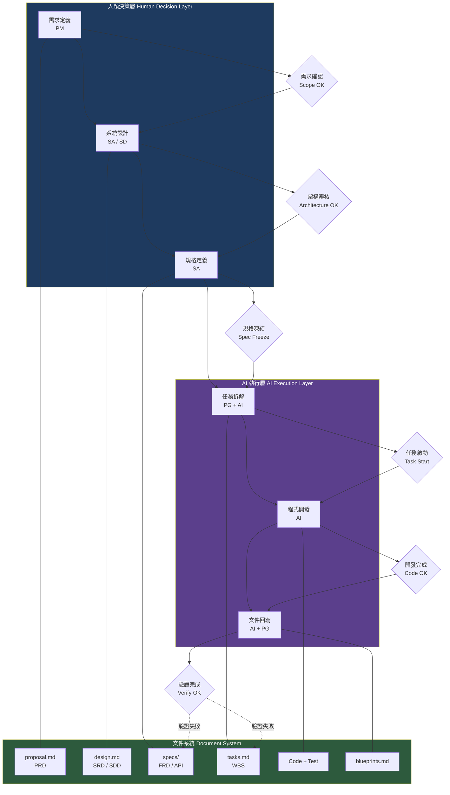

```mermaid
flowchart TB

%% =========================
%% 人類決策層
%% =========================

subgraph H[人類決策層 Human Decision Layer]
    A1[需求定義<br/>PM]
    A2[系統設計<br/>SA / SD]
    A3[規格定義<br/>SA]
end

%% =========================
%% AI 執行層
%% =========================

subgraph AI[AI 執行層 AI Execution Layer]
    B1[任務拆解<br/>PG + AI]
    B2[程式開發<br/>AI]
    B3[文件回寫<br/>AI + PG]
end

%% =========================
%% 文件系統
%% =========================

subgraph DOC[文件系統 Document System]
    D1[proposal.md<br/>PRD]
    D2[design.md<br/>SRD / SDD]
    D3[specs/<br/>FRD / API]
    D4[tasks.md<br/>WBS]
    D5[Code + Test]
    D6[blueprints.md]
end

%% =========================
%% 主流程
%% =========================

A1 --> A2
A2 --> A3

A3 --> B1
B1 --> B2
B2 --> B3

%% =========================
%% 文件對應
%% =========================

A1 --- D1
A2 --- D2
A3 --- D3

B1 --- D4
B2 --- D5
B3 --- D6

%% =========================
%% Gate 機制
%% =========================

G1{需求確認<br/>Scope OK}
G2{架構審核<br/>Architecture OK}
G3{規格凍結<br/>Spec Freeze}
G4{任務啟動<br/>Task Start}
G5{開發完成<br/>Code OK}
G6{驗證完成<br/>Verify OK}

A1 --> G1 --> A2
A2 --> G2 --> A3
A3 --> G3 --> B1
B1 --> G4 --> B2
B2 --> G5 --> B3
B3 --> G6

%% =========================
%% 閉環機制
%% =========================

G6 -. 驗證失敗 .-> D3
G6 -. 驗證失敗 .-> D4

%% =========================
%% 樣式
%% =========================

style H fill:#1e3a5f,color:#fff
style AI fill:#5b3f8c,color:#fff
style DOC fill:#2d5a3d,color:#fff
```