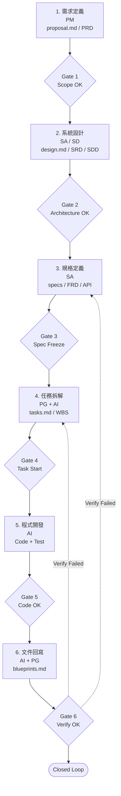

```mermaid
flowchart TD

A[1. 需求定義<br/>PM<br/>proposal.md / PRD]
--> G1{Gate 1<br/>Scope OK}

G1 --> B[2. 系統設計<br/>SA / SD<br/>design.md / SRD / SDD]

B --> G2{Gate 2<br/>Architecture OK}

G2 --> C[3. 規格定義<br/>SA<br/>specs / FRD / API]

C --> G3{Gate 3<br/>Spec Freeze}

G3 --> D[4. 任務拆解<br/>PG + AI<br/>tasks.md / WBS]

D --> G4{Gate 4<br/>Task Start}

G4 --> E[5. 程式開發<br/>AI<br/>Code + Test]

E --> G5{Gate 5<br/>Code OK}

G5 --> F[6. 文件回寫<br/>AI + PG<br/>blueprints.md]

F --> G6{Gate 6<br/>Verify OK}

G6 --> Z([Closed Loop])

G6 -. Verify Failed .-> C
G6 -. Verify Failed .-> D
```